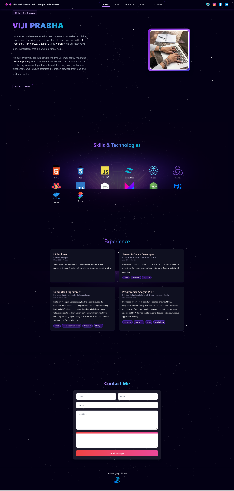

## Build and Deploy Modern Animated Portfolio Website | Next.js 14, Framer Motion, Tailwind CSS

The Build and Deploy a Modern Portfolio Website tutorial demonstrates the creation of a cutting-edge portfolio website using Next.js, Framer Motion, Tailwind CSS, and TypeScript. This project offers an immersive learning experience by combining the power of Next.js for server-side rendering, Framer Motion for stunning animations, Tailwind CSS for rapid styling, and TypeScript for type safety.

Developers will learn how to leverage Next.js's advanced features, such as routing and static site generation, to build a high-performance and SEO-friendly portfolio website. Framer Motion adds fluid and interactive animations to enhance the user experience, while Tailwind CSS streamlines styling with its utility-first approach. TypeScript ensures code reliability and scalability by providing static typing and error prevention.

Through this tutorial, developers can create a visually captivating and responsive portfolio website that effectively showcases their skills, projects, and achievements. By deploying the website using Next.js's built-in deployment options, developers can share their portfolio with the world and attract potential clients or employers. Overall, this project equips developers with the tools and knowledge to build modern and professional portfolio websites that stand out in today's competitive landscape.



<div align="center">
  <div>
    
    
    
  </div>

  <h3 align="center">Portfolio Website</h3>

</div>

## 📋 <a name="table">Table of Contents</a>

- Next.js
- Tailwind CSS

## <a name="quick-start">🤸 Quick Start</a>

Follow these steps to set up the project locally on your machine.

**Prerequisites**

Make sure you have the following installed on your machine:

- [Git](https://git-scm.com/)
- [Node.js](https://nodejs.org/en)
- [npm](https://www.npmjs.com/) (Node Package Manager)

**Cloning the Repository**

```bash
git clone https://github.com/vijitibu/my-portfolio

```

**Installation**

Install the project dependencies using npm:

```bash
npm install
```

**Running the Project**

```bash
npm run dev
```

Open [http://localhost:3000](http://localhost:3000) in your browser to view the project.

## <a name="snippets">🕸️ Snippets</a>

<details>
<summary><code>motion.ts</code></summary>

```typescript
export function slideInFromLeft(delay: number) {
    return {
      hidden: { x: -100, opacity: 0 },
      visible: {
        x: 0,
        opacity: 1,
        transition: {
          delay: delay,
          duration: 0.5,
        },
      },
    };
  }
  
  export function slideInFromRight(delay: number) {
    return {
      hidden: { x: 100, opacity: 0 },
      visible: {
        x: 0,
        opacity: 1,
        transition: {
          delay: delay,
          duration: 0.5,
        },
      },
    };
  }
  
  export const slideInFromTop = {
    hidden: { y: -100, opacity: 0 },
    visible: {
      y: 0,
      opacity: 1,
      transition: {
        delay: 0.5,
        duration: 0.5,
      },
    },
  };
```

</details>

<details>
<summary><code>globals.css</code></summary>

```typescript
@import url("https://fonts.googleapis.com/css2?family=Cedarville+Cursive&display=swap");
@tailwind base;
@tailwind components;
@tailwind utilities;

.cursive {
  font-family: "Cedarville Cursive", cursive;
}

.Welcome-text {
  background: linear-gradient(0deg,
      rgba(255, 255, 255, 0.4),
      rgba(255, 255, 255, 0.4)),
    linear-gradient(90.01deg, #e59cff 0.01%, #ba9cff 50.01%, #9cb2ff 100%);
  background-blend-mode: normal, screen;
  -webkit-background-clip: text;
  background-clip: text;
  -webkit-text-fill-color: transparent;
}

.Welcome-box {
  isolation: isolate;
  overflow: hidden;
  align-items: center;
  -webkit-backdrop-filter: blur(6px);
  backdrop-filter: blur(6px);
  border-radius: 32px;
  box-shadow: inset 0 -7px 11px #a48fff1f;
  display: flex;

  position: relative;
  width: -moz-max-content;
  width: max-content;
  transition: 0.45s cubic-bezier(0.6, 0.6, 0, 1) box-shadow;
}

.button-primary {
  background: linear-gradient(180deg,
      rgba(60, 8, 126, 0) 0%,
      rgba(60, 8, 126, 0.32) 100%),
    rgba(113, 47, 255, 0.12);
  box-shadow: inset 0 0 12px #bf97ff3d;
}

.button-primary:hover {
  background: linear-gradient(180deg,
      rgba(60, 8, 126, 0) 0%,
      rgba(60, 8, 126, 0.42) 100%),
    rgba(113, 47, 255, 0.24);
  box-shadow: inset 0 0 12px #bf97ff70;
}

/* Hide scrollbar for IE, Edge and Firefox */
.scrollbar-hidden {
  -ms-overflow-style: none;
  /* IE and Edge */
  scrollbar-width: none;
  /* Firefox */
}

.scrollbar-hidden::-webkit-scrollbar {
  display: none;
}


html {
  scroll-behavior: smooth;
}
```

</details>

<details>
<summary><code>constants.ts</code></summary>

```typescript
export const Skill_data = [
    {
      skill_name: "Html 5",
      Image: "/html.png",
      width: 80,
      height: 80,
    },
    {
      skill_name: "Css",
      Image: "/css.png",
      width: 80,
      height: 80,
    },
    {
      skill_name: "Java Script",
      Image: "/js.png",
      width: 65,
      height: 65,
    },
    {
      skill_name: "Tailwind Css",
      Image: "/tailwind.png",
      width: 80,
      height: 80,
    },
    {
      skill_name: "React",
      Image: "/react.png",
      width: 80,
      height: 80,
    },
    {
      skill_name: "Redux",
      Image: "/redux.png",
      width: 80,
      height: 80,
    },
    {
      skill_name: "React Query",
      Image: "/reactquery.png",
      width: 80,
      height: 80,
    },
    {
      skill_name: "Type Script",
      Image: "/ts.png",
      width: 80,
      height: 80,
    },
    {
      skill_name: "Next js 13",
      Image: "/next.png",
      width: 80,
      height: 80,
    },
    {
      skill_name: "Framer Motion",
      Image: "/framer.png",
      width: 80,
      height: 80,
    },
    {
      skill_name: "Stripe Payment",
      Image: "/stripe.webp",
      width: 80,
      height: 80,
    },
    {
      skill_name: "Node js",
      Image: "/node-js.png",
      width: 80,
      height: 80,
    },
    {
      skill_name: "Mongo db",
      Image: "/mongodb.png",
      width: 40,
      height: 40,
    },
  
  ];
  
  export const Socials = [
    {
      name: "Discord",
      src: "/instagram.svg",
    },
    {
      name: "Facebook",
      src: "/facebook.svg",
    },
    {
      name: "Instagram",
      src: "/discord.svg",
    },
  ];
  
  
  
  export const Frontend_skill = [
    {
      skill_name: "Html 5",
      Image: "/html.png",
      width: 80,
      height: 80,
    },
    {
      skill_name: "Css",
      Image: "/css.png",
      width: 80,
      height: 80,
    },
    {
      skill_name: "Java Script",
      Image: "/js.png",
      width: 65,
      height: 65,
    },
    {
      skill_name: "Tailwind Css",
      Image: "/tailwind.png",
      width: 80,
      height: 80,
    },
    {
      skill_name: "Material UI",
      Image: "/mui.png",
      width: 80,
      height: 80,
    },
    {
      skill_name: "React",
      Image: "/react.png",
      width: 80,
      height: 80,
    },
    {
      skill_name: "Redux",
      Image: "/redux.png",
      width: 80,
      height: 80,
    },
    {
      skill_name: "React Query",
      Image: "/reactquery.png",
      width: 80,
      height: 80,
    },
    {
      skill_name: "Type Script",
      Image: "/ts.png",
      width: 80,
      height: 80,
    },
    {
      skill_name: "Next js 13",
      Image: "/next.png",
      width: 80,
      height: 80,
    },
  ];
  
  export const Backend_skill = [
    {
      skill_name: "Node js",
      Image: "/node-js.png",
      width: 80,
      height: 80,
    },
    {
      skill_name: "Express js",
      Image: "/express.png",
      width: 80,
      height: 80,
    },
    {
      skill_name: "Mongo db",
      Image: "/mongodb.png",
      width: 40,
      height: 40,
    },
    {
      skill_name: "Fire base",
      Image: "/Firebase.png",
      width: 55,
      height: 55,
    },
    {
      skill_name: "Postger SQL",
      Image: "/postger.png",
      width: 70,
      height: 70,
    },
    {
      skill_name: "My SQL",
      Image: "/mysql.png",
      width: 70,
      height: 70,
    },
    {
      skill_name: "Prisma",
      Image: "/prisma.webp",
      width: 70,
      height: 70,
    },
    {
      skill_name: "Graphql",
      Image: "/graphql.png",
      width: 80,
      height: 80,
    },
  ];
  
  export const Full_stack = [
    {
      skill_name: "React Native",
      Image: "/ReactNative .png",
      width: 70,
      height: 70,
    },
    {
      skill_name: "Tauri",
      Image: "/tauri.svg",
      width: 70,
      height: 70,
    },
    {
      skill_name: "Docker",
      Image: "/docker.webp",
      width: 70,
      height: 70,
    },
  
    {
      skill_name: "Figma",
      Image: "/figma.png",
      width: 50,
      height: 50,
    },
  
  ];
  
  
  
  export const Other_skill = [
    {
      skill_name: "Go",
      Image: "/go.png",
      width: 60,
      height: 60,
    },
  ];
```

</details>

